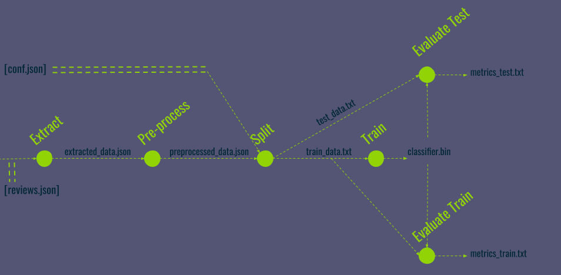

Setup a project using MLV-tools
===============================

The aim of this tutorial is to understand how to setup a Machine Learning project
 development environment using MLV-tools. It explains how to:
 
- Generate Python 3 scripts and DVC pipeline from Jupyter Notebooks
- Re-use pipeline steps with different I/O and parameters
- Create an experiment using git branches
- Re-run a pipeline with input changes

Project example
----------------

This tutorial is based on a text classification pipeline. 

**Dataset:** a set of labeled reviews from Trip Advisor.

> This dataset is a cleaned extract (2) of the publicly available TripAdvisor dataset(1). 

>(1) Wang, H., Lu, Y., Zhai, C.: Latent aspect rating analysis on review text data: A rating regression approach. In: Proceedings of the 16th ACM SIGKDD International Conference on Knowledge Discovery and Data Mining (KDD 2010). pp. 783–792. Washington, US (2010))

>(2) Marcheggiani, D., Täckström, O., Esuli, A, Sebastiani, F.: Hierarchical Multi-Label Conditional Random Fields for Aspect-Oriented Opinion Mining. In: Proceedings of the 36th European Conference on Information Retrieval (ECIR 2014).

To each review is associated a star rating from 1 to 5. We treat these values as categorical and tackle the problem as
a classification problem given the small number of labels. 

**Pipeline**

         
**Pipeline inputs:**

- data/input/reviews.json
- data/input/conf.json

**Pipeline outputs:**

- data/result/metrics_test.txt
- data/result/metrics_train.txt

> This project use [FastText](https://fasttext.cc/). Algorithm are really simple in this pipeline
because the tutorial focus more on pipeline building and project setup using MLV-tools

Start the Docker container (Optional)
--------------------------------------

This tutorial can be done inside a Docker container or directly on your computer.
If you want to use the container, run:

    ./resources/setup_project/docker/run.sh
    
The current git repository is mounted in `/tuto`.

Get Project Resources
---------------------

Resources for this tutorial are in `./resources/setup_project`.

Create a workdir and copy resources:

    mkdir -p ./sandbox
    cp -r ./resources/setup_project/project ./sandbox/
    cd ./sandbox/project && git init
    git add .
    git commit -m 'Project Initialization'
    

**Project structure:**

    .
    ├── classifier
    │   ├── __init__.py
    │   ├── extract.py
    │   ├── helper.py
    │   ├── pre_process.py
    │   └── split.py
    ├── Makefile
    ├── notebooks
    │   ├── evaluate_model.ipynb
    │   ├── extract_data.ipynb
    │   ├── preprocess_data.ipynb
    │   ├── split_dataset.ipynb
    │   └── train_data_model.ipynb
    ├── requirements.txt
    └── setup.py

Setup the environment
----------------------

- Optional: create a virtualenv
<pre>
    cd ..
    virtualenv venv -p /usr/bin/python3.6   #(in provided docker image: /usr/local/bin/python3.6)
    . ./venv/bin/activate
</pre>    
- Or a conda env
 <pre>
    cd ..
    conda create -n venv python=3 pip
    conda activate venv
 </pre>
Install dependencies:

    cd ./project
    make setup
    
    
Initialize DVC
---------------

In `sandbox/project`, run:

    dvc init
    git commit -m 'Project DVC Initialization'

    
    
Phase 1: create the project configuration
----------------------------------------
The MLV-tools configuration file is used to generate script and command paths. It can be provided to each command
or it is auto-detected if it is in the root directory and is named `.mlvtools`.

With your favorite text editor, create a file **./.mlvtools** containing the following:

    {
        "path": {
            "python_script_root_dir": "./pipeline/script",
            "dvc_cmd_root_dir": "./pipeline/dvc"
            }
    }      

Then run:

    git add .mlvtools 
    git commit -m 'Add MLV-tools configuration'
    
And create directories:

    mkdir -p ./pipeline/script
    mkdir -p ./pipeline/dvc
    
Get data:

    cp -r ../../resources/setup_project/data/ ./

    
Phase 2: get configurable steps 
------------------------------

The aim of this first step is to remove hard-coded values and to **identify** which variables are **I/O** and 
**parameters** for each step.

You can edit **Jupyter Notebooks** by running (on your **local machine**):
    
    jupyter notebook ./notebooks
    
and then modify the notebooks in your browser. **I/O** and **parameters**  need to be assigned in the first code cell of the notebook.

> If you are using the Docker container, you can edit Jupyter Notebooks from your local machine as the whole project
is mounted inside the container as a volume.

*For example in `notebooks/extract_data.ipynb`, the first cell will look like that:*

    reviews_path = '../data/input/trip_advisor.json'
    extracted_data_path = '../data/intermediate/extracted_data.json'

Perform the same transformation for all notebooks.

 
<i>Shortcut</i>

  Configurable notebooks are availables in: `./resources/setup_project/solution/configurables`
  
    cp ../../resources/setup_project/solution/configurables/* ./notebooks

Pipeline dependencies are built according to **I/O** and **parameters**.

Commit Notebooks changes:

    git add ./notebooks
    git commit -m 'Get configurable notebooks'

Phase 3: generate scripts and DVC pipeline step commands
--------------------------------------------------------

To setup a **DVC** step, we need an executable command. To obtain an **executable command** from
a Jupyter notebook, we need a tool to convert them.

MLV-tools provides 3 main commands:

- **ipynb_to_python**: convert a Jupyter Notebook (+ MLV-tools docstring) to an **executable** and **configurable** Python 3 script
- **gen_dvc**: generate a dvc step command from a Python3 script (+ MLV-tools docstring)

- **ipynb_to_dvc**: generate both (Python3 script + DVC command) from a Jupyter Notebook (+ MLV-tools docstring)

In following steps we will use **ipynb_to_dvc**.

See [MLV-tools documentation](https://github.com/peopledoc/ml-versioning-tools)

#### Describe parameters to generate Python scripts

For this example, we will work on `notebooks/split_dataset.ipynb`. 

I/O and Parameters:

    preprocessed_data_path = '../data/intermediate/preprocessed_data.json'
    train_dataset_path = '../data/intermediate/train_dataset.txt'
    test_dataset_path = '../data/intermediate/test_dataset.txt'
    test_percent = 0.15

We need to specify to MLV-tools which variables are script parameters. This can be done through a
docstring in the **first code cell**.

Docstring syntax: `:param [type]? [param_name]: [description]?`

First code cell:
<pre>
  <b>"""</b>
  <b> :param str preprocessed_data_path: Path to preprocessed data input file</b>
  <b> :param str train_dataset_path: Path to train data output file</b>
  <b> :param str test_dataset_path: Path to test data output file</b>
  <b> :param float test_percent: Percentage of test data (example: 0.15)</b>
  <b>"""</b>
  # Following code in this cell will not be add in the generated Python script
  # They are values only for notebook purpose
  preprocessed_data_path = '../data/intermediate/preprocessed_data.json'
  train_dataset_path = '../data/intermediate/train_dataset.txt'
  test_dataset_path = '../data/intermediate/test_dataset.txt'
  test_percent = 0.15
</pre>

#### Describe parameters for DVC step

Now we need to specify to MLV-tools which are the **dependencies** and the **outputs** of the DVC step.
It is also possible to provide extra parameters for the command the DVC step calls. 

<pre>
    """
     :param str preprocessed_data_path: Path to preprocessed data input file
     :param str train_dataset_path: Path to train data output file
     :param str test_dataset_path: Path to test data output file
     :param float test_percent: Percentage of test data (example: 0.15)
     
     <b>:dvc-in preprocessed_data_path: ./data/intermediate/preprocessed_data.json</b>
     <b>:dvc-out train_dataset_path: ./data/intermediate/train_dataset.txt</b>
     <b>:dvc-out test_dataset_path: ./data/intermediate/test_dataset.txt</b>
     <b>:dvc-extra: --test-percent 0.15</b>
    """
    # Following code in this cell will not be add in the generated Python script
    # They are values only for notebook purpose
    preprocessed_data_path = '../data/intermediate/preprocessed_data.json'
    train_dataset_path = '../data/intermediate/train_dataset.txt'
    test_dataset_path = '../data/intermediate/test_dataset.txt'
    test_percent = 0.15
</pre>

> Note: The docstring support Jinja templating. Paths and parameters can be provided through a YAML configuration,
see the [documentation](https://github.com/peopledoc/ml-versioning-tools#dvc-templating).

#### Generate Python script & DVC step command

We will generate both the Python3 script and the DVC command using the following MLV-tools command: 

    ipynb_to_dvc -n ./notebooks/split_dataset.ipynb
    
> Output paths are generated according to the Notebook name and the configuration file.

 
<i>More</i>

  
  It is possible to first generate the Python3 executable and configurable script:
  
    ipynb_to_python -n ./notebooks/split_dataset.ipynb [-o output_path]?
    
  Then to generate the DVC step command.
  
    gen_dvc -i ./pipeline/scripts/mlvtools_split_dataset.py [-o output_path]?

**Results**:

    #:> tree ./pipeline
    pipeline/
    ├── dvc
    │   └── mlvtools_split_dataset_dvc
    └── script
        └── mlvtools_split_dataset.py
    
    2 directories, 2 files

 

    [The Python3 script]
    ./pipeline/script/mlvtools_split_dataset.py -h
    
    [The DVC step]  
    cat ./pipeline/dvc/mlvtools_split_dataset_dvc

#### Discard No Effect cells

If you open `./pipeline/script/mlvtools_split_dataset.py` you will see there are some **no effect** statements.

Example: 

        len(preprocessed_data)
        
Add `# No effect` in each no effect cells to discard them into the generated Python 3 script.

Then re-generate:

    ipynb_to_dvc -n ./notebooks/split_dataset.ipynb -f

#### Apply on all notebooks

Perform the **Phase 3** for all remaining notebooks.

 
<i>Shortcut</i>

  MLV-tools notebooks are availables in: `./resources/setup_project/solution/mlvtools`
  
    cp ../../resources/setup_project/solution/mlvtools/* ./notebooks
    
  Then run:
    
    ipynb_to_dvc -n ./notebooks/extract_data.ipynb 
    ipynb_to_dvc -n ./notebooks/preprocess_data.ipynb 
    ipynb_to_dvc -n ./notebooks/split_dataset.ipynb 
    ipynb_to_dvc -n ./notebooks/train_data_model.ipynb 
    ipynb_to_dvc -n ./notebooks/evaluate_model.ipynb 
    
  

 
<i>Result</i>

    #:> tree ./pipeline
    pipeline/
    ├── dvc
    │   ├── mlvtools_evaluate_model_dvc
    │   ├── mlvtools_extract_data_dvc
    │   ├── mlvtools_preprocess_data_dvc
    │   ├── mlvtools_split_dataset_dvc
    │   └── mlvtools_train_data_model_dvc
    └── script
        ├── mlvtools_evaluate_model.py
        ├── mlvtools_extract_data.py
        ├── mlvtools_preprocess_data.py
        ├── mlvtools_split_dataset.py
        └── mlvtools_train_data_model.py

    2 directories, 10 files

    
Commit Notebooks changes:

    git add ./notebooks
    git commit -m 'Set MLV-tools docstring in notebooks'
    
Commit pipeline steps

    git add ./pipeline
    git commit -m 'Pipeline setup: Python 3 scripts and DVC steps'

Phase 4: run DVC steps
---------------------

Version pipeline inputs with DVC
    
    dvc add ./data/input/*
    git add ./data/input/
    git commit -m 'Add pipeline inputs'
    
    rm -rf ./data/intermediate/ ./data/model/ ./data/result/

Then run each step once using DVC commands.

    ./pipeline/dvc/mlvtools_extract_data_dvc 
    git add .
    git commit -m 'Extract data step run'
    
    ./pipeline/dvc/mlvtools_preprocess_data_dvc
    git add .
    git commit -m 'Preprocess data step run'
    
    ./pipeline/dvc/mlvtools_split_dataset_dvc 
    git add .
    git commit -m 'Split data step run'

    ./pipeline/dvc/mlvtools_train_data_model_dvc 
    git add .
    git commit -m 'Train model step run'
    
    ./pipeline/dvc/mlvtools_evaluate_model_dvc
    git add .
    git commit -m 'Evaluate model on test data step run'

 
<i>See data directory</i>
    

    #:> tree -a ./data/
    ./data/
    ├── input
    │   ├── .gitignore
    │   ├── conf.json
    │   ├── conf.json.dvc
    │   ├── trip_advisor.json
    │   └── trip_advisor.json.dvc
    ├── intermediate
    │   ├── .gitignore
    │   ├── extracted_data.json
    │   ├── preprocessed_data.json
    │   ├── test_dataset.txt
    │   └── train_dataset.txt
    ├── model
    │   ├── classifier.bin
    │   └── .gitignore
    └── result
        ├── .gitignore
        └── metrics_test.txt
    
    4 directories, 15 files

See the execution result:

    cat ./data/result/metrics_test.txt 
 

Phase 5: reuse a step
--------------------

Now we are ready to run the **evaluation** step on new data. Here, we will create a new pipeline step to get the 
train metrics, i.e. run the last step on the **train dataset** instead of **test dataset**. 

The code will be exactly the same than the one for the evaluation on the **test dataset**, only inputs differ.

1. Copy the DVC evaluation step command
<pre>cp ./pipeline/dvc/mlvtools_evaluate_model_dvc ./pipeline/dvc/mlvtools_evaluate_model_train_dvc</pre>
    
2. Update **dataset** dependency in the new step `./pipeline/dvc/mlvtools_evaluate_model_train_dvc`

    The following set of **bash varaibles** is used as dvc run command arguments.
<pre>
MLV_PY_CMD_PATH="pipeline/script/mlvtools_evaluate_model.py"
MLV_PY_CMD_NAME="mlvtools_evaluate_model.py"
MODEL_PATH="./data/model/classifier.bin"
<b>DATASET_PATH="./data/intermediate/test_dataset.txt"</b>
<b>METRICS_PATH="./data/result/metrics_test.txt"</b>

# META FILENAME, MODIFY IF DUPLICATE
<b>MLV_DVC_META_FILENAME="mlvtools_evaluate_model.dvc"</b>
</pre>        
     
We need to update:

- **MLV_DVC_META_FILENAME**: the DVC step name.
- **I/O**: DATASET_PATH and METRICS_PATH to provide the tain dataset and generate the new metrics output.
    
Update `./pipeline/dvc/mlvtools_evaluate_model_train_dvc` with:
<pre>
MLV_PY_CMD_PATH="pipeline/script/mlvtools_evaluate_model.py"
MLV_PY_CMD_NAME="mlvtools_evaluate_model.py"
MODEL_PATH="./data/model/classifier.bin"
DATASET_PATH="./data/intermediate/<b>train</b>_dataset.txt"
METRICS_PATH="./data/result/metrics_<b>train</b>.txt"

# META FILENAME, MODIFY IF DUPLICATE
MLV_DVC_META_FILENAME="mlvtools_evaluate_model<b>_train</b>.dvc"
</pre>
   
 
3. Run the new command to create the new step.
    
<pre>    
    ./pipeline/dvc/pipeline/dvc/mlvtools_evaluate_model_train_dvc
    git add .
    git commit -m 'Evaluate model on train data step run'
</pre>

 
<i>See data directory</i>
    

    #:> tree -a ./data/
    ./data/
    ├── input
    │   ├── .gitignore
    │   ├── conf.json
    │   ├── conf.json.dvc
    │   ├── trip_advisor.json
    │   └── trip_advisor.json.dvc
    ├── intermediate
    │   ├── .gitignore
    │   ├── extracted_data.json
    │   ├── preprocessed_data.json
    │   ├── test_dataset.txt
    │   └── train_dataset.txt
    ├── model
    │   ├── .gitignore
    │   └── classifier.bin
    └── result
        ├── .gitignore
        ├── metrics_test.txt
        └── metrics_train.txt
    
    4 directories, 15 files

See the execution result:

    cat ./data/result/metrics_train.txt 

Phase 6: see the pipeline
------------------------

It is possible to visualize the pipeline with the `dvc pipeline show` command.

Run:

    dvc pipeline show ./mlvtools_evaluate_model* --ascii

Phase 7: reproduce a pipeline
-----------------------------

DVC handle dependencies between steps, so it is possible to modify the configuration file then to 
reproduce only needed steps to compute updated metrics.

- Modify the training learning rate in `./data/input/conf.json`

- Run `dvc status` to see impacted steps

        #:> dvc status
        WARNING: Corrupted cache file .dvc/cache/c9/730ae77c8c040833a6c8588c0ec2e5.
        mlvtools_train_data_model.dvc:
            changed deps:
                modified:           data/input/conf.json
        data/input/conf.json.dvc:
            changed outs:
                not in cache:       data/input/conf.json
                
- Track pipeline input change
    
        dvc add ./data/input/conf.json

- Run `dvc status` again to see remaining out-dated steps

        #:> dvc status
        mlvtools_train_data_model.dvc:
        	changed deps:
        		modified:           data/input/conf.json

- Re-compute metrics steps  (ie `mlvtools_evaluate_model.dvc` and `mlvtools_evaluate_model_train.dvc`)
    
        dvc repro mlvtools_evaluate_model*
        git checkout -b exp_bigger_learning_rate && git add . 
        git commit -m 'Increased learning rate results'     

Phase 8: change of branch
------------------------

After phase 7 you must be on Git **exp_bigger_learning_rate** branch.

Display metrics from **exp_bigger_learning_rate**:

    cat ./data/result/metrics*
    
Display metrics from **master branch**:

    git checkout
    dvc checkout
    cat ./data/result/metrics*

**Important**: don't forget to run **dvc checkout** after each **git checkout**.

Your reached the end of this tutorial. Now your project is setup to run with DVC. To explore
more complex cases try [others tutorials](https://github.com/peopledoc/mlv-tools-tutorial#tutorial)
